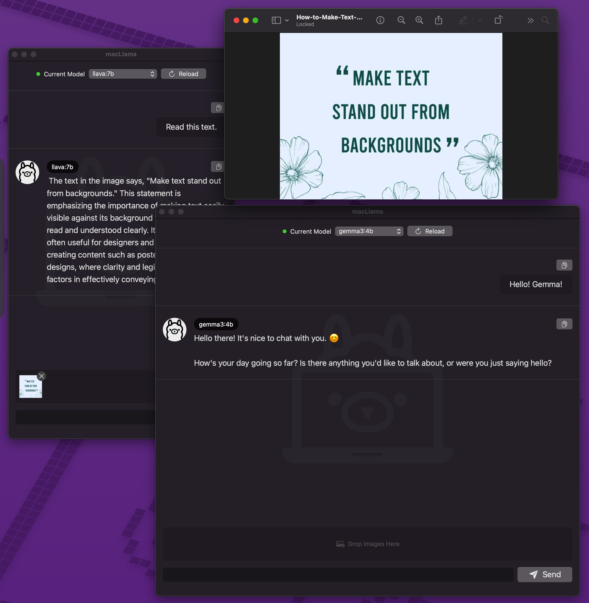

# macLlama


## macLlama: A Native macOS GUI for Ollama

 

Welcome to **macLlama**! This macOS application, built with SwiftUI, offers a user-friendly interface for interacting with Ollama. We've recently added features to **start the Ollama server directly from the app** and made several **UI improvements** for a smoother experience.

## System Requirements

To ensure the best experience with the macLlama, your system should meet the following requirements:

*   **Operating System:** macOS 14.0 Sonoma or later.
*   **Processor:** Apple Silicon (e.g., M1, M2, M3 series).
*   **Memory (RAM):** The memory required will depend on the Ollama models you plan to use. Larger models require more RAM. Please refer to the official [Ollama documentation](https://github.com/ollama/ollama/blob/main/docs/faq.md#what-are-the-system-requirements-to-run-ollama) for model-specific recommendations.
*   **Ollama Installation:** A working installation of Ollama is required (see Prerequisites below).

## Prerequisites

To use this app, you'll first need to install Ollama.

### 1. Install Homebrew (if you don't have it)

Homebrew is a package manager for macOS that simplifies software installation.

1.  Open your Terminal (you can find it in `/Applications/Utilities/`).
2.  Run the following command:
    ```bash
    /bin/bash -c "$(curl -fsSL https://raw.githubusercontent.com/Homebrew/install/HEAD/install.sh)"
    ```

### 2. Install Ollama CLI

Once Homebrew is installed, you can install Ollama.

1.  In Terminal, run:
    ```bash
    brew install ollama
    ```
2.  Verify the installation:
    ```bash
    ollama --version
    ```
    You should see the installed Ollama CLI version.

## Getting Started

### 1. Running the Ollama Server

The macLlama can now help you start the Ollama server. Alternatively, you can start it manually.

*   **From the App:** Look for an option within the macLlama to start the server.
*   **Manually (via Terminal):**
    ```bash
    ollama serve
    ```
    (You might also see `ollama start` used in older documentation, but `ollama serve` is common).

### 2. Installing Ollama Models

Before you can chat, you need to download models for Ollama to use. You can do this in a couple of ways:

*   **Via Terminal:**
    ```bash
    ollama pull <model_name>
    ```
    For example, to download the Llama 3 8B instruct model, you would run:
    ```bash
    ollama pull llama3:8b-instruct
    ```
    You can find a list of available models on the Ollama Library.

*   **Install via macLlama's Preference panel:** Go to "Model Management" tab -> input model name you want -> push "Pull" button.

## Using the macLlama

Once the Ollama server is running and you have at least one model installed, you can launch and use the macLlama to interact with your local large language models.

## Chat History (v1.0.5 - Build 2)

macLlama securely stores your chat conversations locally using SwiftData. You can access and manage your chat history through the following methods:

**Viewing / Managing Chat History:**

*   **Menu:**  Go to Menu > Window > Chat History. This will display your conversation history.

**Resetting Chat History (Advanced - Use with Caution):**

If you encounter issues with macLlama's GUI regarding chat history, you can manually manage the SwiftData storage. *However, this is an advanced operation and should only be attempted if you understand the potential consequences.*

**To reset your chat history:**

1.  Navigate to your local destination: `~/Library/Application Support/`
2.  Locate and delete the following files:
    *   `default.store`
    *   `default.store-shm`
    *   `default.store-wal`

**WARNING:** These files are the default SwiftData storage files.  **Deleting them will remove *all* SwiftData storage for macLlama, as well as potentially impacting other applications that utilize SwiftData.**  Proceed with extreme caution and only if you are comfortable with the implications.  Backing up your local storage is *highly* recommended before attempting this.

## 🚀 Getting Started

### Prerequisites

To fully utilize the capabilities of this app, you'll need to have Ollama installed and running on your system.

1.  **Install Ollama:**
    If you haven't already, download and install Ollama from the official website or via Homebrew:
    ```bash
    brew install ollama
    ```
2.  **Verify Ollama Installation:**
    ```bash
    ollama --version
    ```
3.  **Run Ollama:**
    Ensure the Ollama service is running. You can start it by typing the following in your Terminal:
    ```bash
    ollama serve
    ```
    Or, if you have the Ollama macOS application, ensure it is running.
4.  **Pull a Model (Optional but Recommended):**
    If you don't have any models yet, pull one using the Ollama CLI:
    ```bash
    ollama pull llama3 # Or any other model you prefer, e.g., mistral, gemma
    ```

### Installation & Running the App

1.  **Download the Application:**
    *   Go to the Releases Page of this repository.
    *   Download the latest `macLlama.app.zip` file from the Assets section. This archive contains the `macLlama.app` file.
2.  **Install:**
    *   Unzip the downloaded file.
    *   Drag the extracted `macLlama.app` file to your `/Applications` folder.
3.  **Run the App:**
    Open `macLlama` from your Applications folder.

## 📖 Usage

1.  Ensure your Ollama service is running in the background.
2.  Launch the macLlama.
3.  The app will attempt to load available models from your Ollama instance.
4.  Select a model from the dropdown menu.
5.  Type your message in the input field and press Enter or click the "Send" button.
6.  Converse with the model!

## 🤝 Contributing

Contributions are what make the open-source community such an amazing place to learn, inspire, and create. Any contributions you make are **greatly appreciated**.

If you have a suggestion that would make this better, please fork the repo and create a pull request. You can also simply open an issue with the tag "enhancement".
Don't forget to give the project a star! Thanks again!

1.  Fork the Project
2.  Create your Feature Branch (`git checkout -b feature/AmazingFeature`)
3.  Commit your Changes (`git commit -m 'Add some AmazingFeature'`)
4.  Push to the Branch (`git push origin feature/AmazingFeature`)
5.  Open a Pull Request

## 📜 License

Distributed under the Apache 2.0 License. See `LICENSE.txt` for more information.

## ⚒️ Frameworks & Libraries

macLlama utilizes the following frameworks and libraries to provide a rich and interactive experience:

*   **SwiftUI:**  macLlama is built using SwiftUI, Apple’s declarative UI framework, for creating a modern and responsive user interface.
*   **MarkdownUI:**  We leverage the [MarkdownUI](https://github.com/gonzalezreal/swift-markdown-ui) library to render your chat messages in a clean and easily readable Markdown format. This allows for rich formatting within your conversations.


## 📧 Contact

Project Discusstion: https://github.com/hellotunamayo/macLlama/discussions

Project Link: https://github.com/hellotunamayo/macLlama

## 🙏 Acknowledgements

*   Ollama Team
*   Contributors to libraries used

Enjoy using the macLlama! 😊
